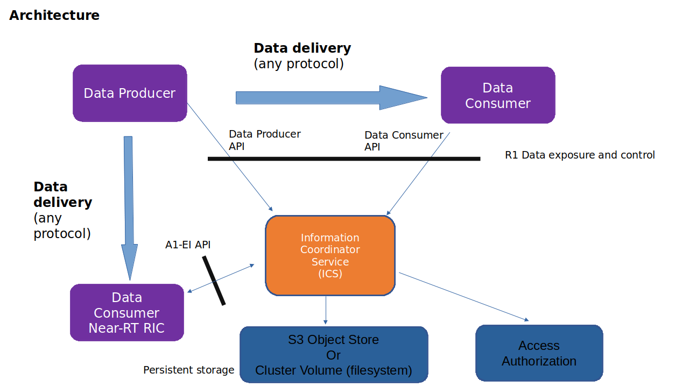
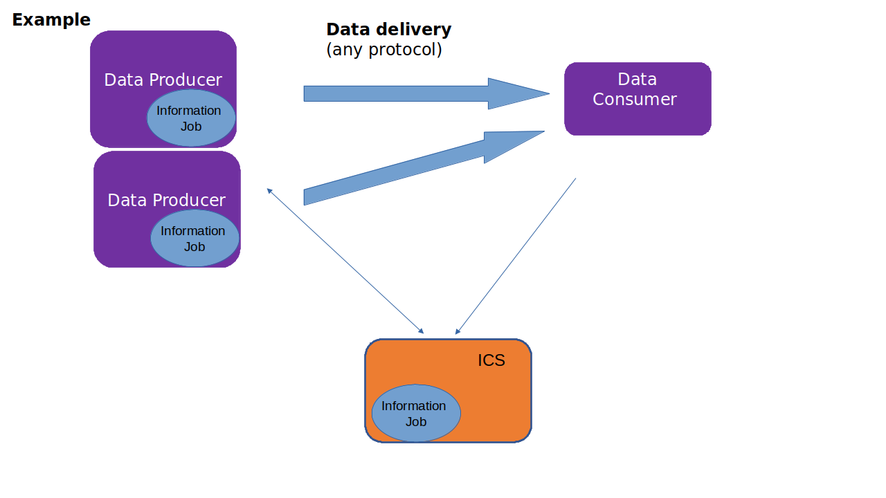

.. This work is licensed under a Creative Commons Attribution 4.0 International License.
.. SPDX-License-Identifier: CC-BY-4.0
.. Copyright (C) 2021 Nordix

Information Coordination Service
~~~~~~~~~~~~~~~~~~~~~~~~~~~~~~~~

The Information Coordination Service (ICS) is a generic service that maintains data subscriptions. Its main purpose is
to decouple data consumers and data producers in a multi vendor environment. A data consumer does not need to know anything about
the producers of the data.

This product is a part of :doc:`NONRTRIC <nonrtric:index>`.

The following terms are used:

* **Data Consumer**, is a subscriber of data. Subscription is done by creating an "Information Job". A data consumer can for instance be an R-App (using the R1 API) or a NearRT-RIC consuming Enrichment Information (and uses the A1-EI API provided by this service).
* **Information Type**, is a type of information. This defines an interface between consumers and producers. Each information type defines which parameters can be used for creating an information job. These parameters are defined by a Json schema connected to the Information Type. These parameters may for instance include:

  * Parameters related to data delivery (for instance a callback URL if REST is used or a Kafka stream). These are different for different delivery protocols.
  * Filtering or other information for data selection.
  * Periodicy
  * Other info used for aggregation

* **Data Producer** is a producer of data. A producer will get notified about all information jobs of its supported types. This also means that filtering is done at the producer (ideally at the source of the data). A data producer can for instance be an R-App.

One information type can be supported by zero to many data producers and can be subscribed to by zero to many data consumers. For instance there can be two data producers for a type of data; one from one vendor (handling a part of the network) and another from another vendor. A data consumer is agnostic about this.

Information Jobs and types are stored persistently by ICS in a local database. This can be either using Amazon S3 - Cloud Object Storage or file system.

To restrict which data that can be consumed by by whom there is support for finegrained access control. When data subscriptions/jobs are modified or read, an access check can be performed.
ICS can be configured to call an external authorizer. 
This can be for instance Open Policy Agent (OPA) which can grant or deny accesses based on an access token (JWT) used by the calling data consumer.
In addition to this the information type, accesstype (read/write) and all type specific parameters can be used by access rules.

The URL to the authorization component is defined in the application.yaml file and the call invoked to by ICS is described in API documentation.

*********************
Summary of principles
*********************

* ICS provides APIs for control of data subscriptions, but is not involved in the delivery of data. This means that any delivery protocol can be used.
* Data for one Information type can be produced by many producers from different vendors.
* Data filtering is done at the producer.
* A Data Consumer can create a data subscription (Information Job) regardless of the status of the data producers. The producers can come and go without any need for the Data Consumer to take any action.
  A subscription indicates the need for a type of data and the system should do its best to fulfill this.

*******
Example
*******

In the example, there is one subscription and the type of data is supported by two producers. That means that both producers are aware of the information job and will delver data directly to the subscriber.

So a typical sequence is that:

* An Information Type is registered.
* Producers of the Information Types are registered
* A Consumer creates an Information Job of the type and supplies the type specific parameters for data delivery and filtering etc.
* The producers gets notified of the job and will start producing data.

If a new producer is started, it will register itself and will get notified of all jobs of its supported types.

**************
Implementation
**************

Implemented as a Java Spring Boot application.
